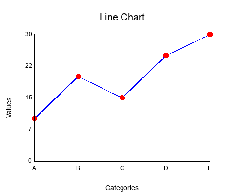
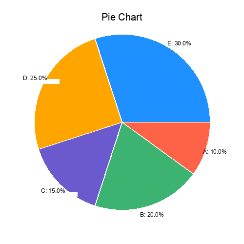
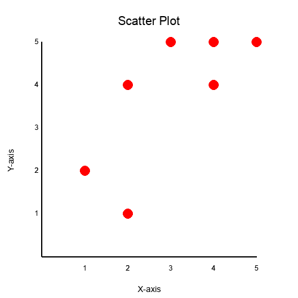

# uggo
## Tastefully Ugly Charts!
Just a fun experiment on making my own charting library using just [PIL/pillow](https://python-pillow.org/).

```sh
pip install uggo
```

You can also fiddle with the code and install the package locally.

```sh
pip install -e .
```

## Examples








## Usage
```python
import uggo

# Example data
data = [10, 20, 15, 25, 30]
labels = ['A', 'B', 'C', 'D', 'E']
x_label = "Categories"
y_label = "Values"
chart_width=500
chart_height=500

# Create and show pie chart
pie_chart = uggo.PieChart(width=chart_width, height=chart_height, data=data, labels=labels, title="Pie Chart")
pie_image = pie_chart.draw()
pie_image.save("piechart.png")

# Create and show line chart
line_chart = uggo.LineChart(chart_width, chart_height, data, labels, x_label, y_label, title="Line Chart")
line_image = line_chart.draw()
line_image.save("linechart.png")

# Create and show bar chart
bar_chart = uggo.BarChart(chart_width, chart_height, data, labels, x_label, y_label, gap_percentage=0.2, title="Bar Chart")
bar_image = bar_chart.draw()
bar_image.save("barchart.png")

# Create and show scatter chart
scatter_data = [(1, 2), (2, 1), (2, 4), (3, 5), (4, 4), (4, 5), (5, 5)]
scatter = uggo.ScatterChart(
    width=chart_width,
    height=chart_height,
    data=scatter_data,
    labels=[str(x) for x, _ in scatter_data],
    x_label="X-axis",
    y_label="Y-axis",
    title="Scatter Plot",
    point_color='red',
    point_size=8
)
scatter_image = scatter.draw()
scatter_image.save("scatterchart.png")
```
